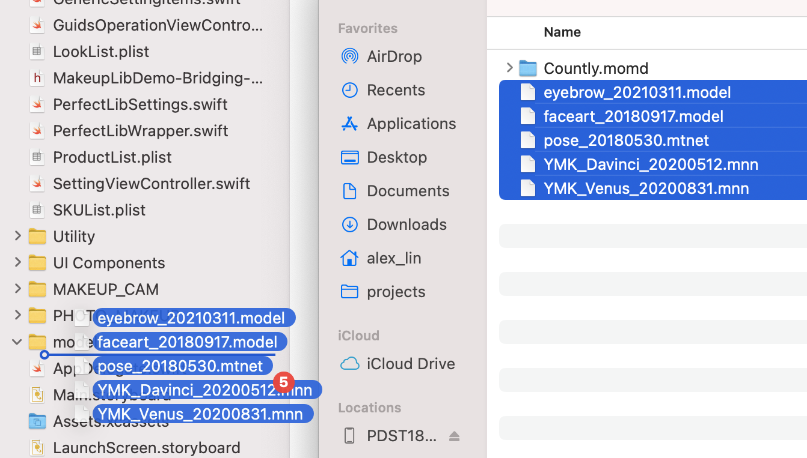
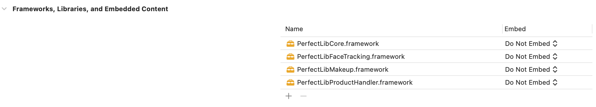
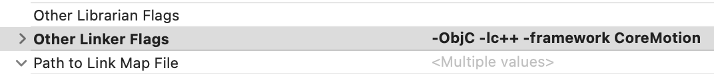
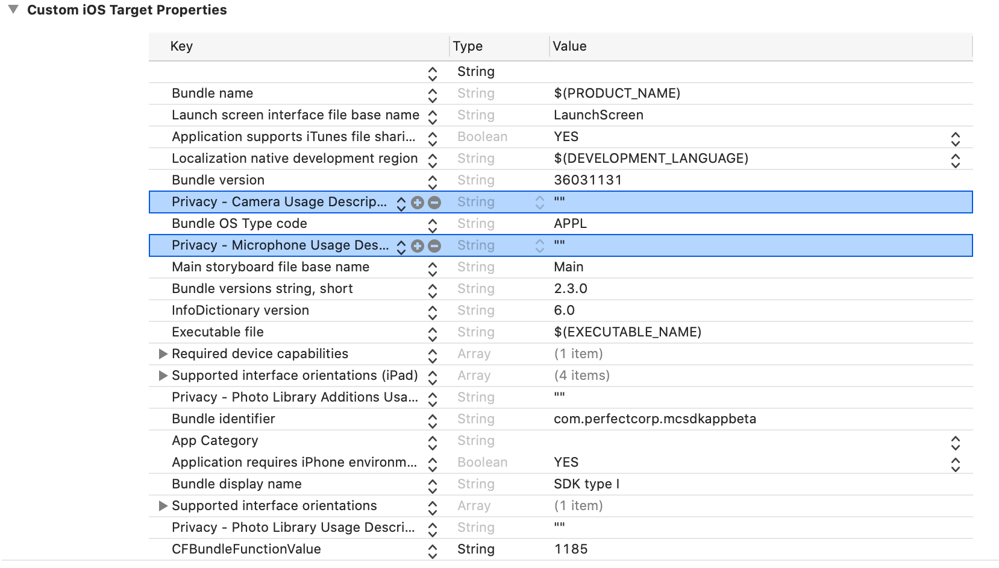

# Skincare

Make sure you have the following installed on your machine:
- [Dart](https://dart.dev/get-dart)
- [Flutter](https://flutter.dev/docs/get-started/install)
  - 3.13.9 [Flutter SDK archive](https://docs.flutter.dev/release/archive)

## Getting Started

1. **Navigate to the Project Directory:**

    ```bash
    cd makeup
    ```

2. **Install Dependencies:**

    ```bash
    flutter pub get
    ```

3. **Run the App:**

    ```bash
    flutter run
    ```

   This command will build and launch the app on an available emulator or connected device.

## Required files

### Android
1. Place the model file in the `android/app/src/main/assets` folder.
2. Put the AAR (Android Archive) file in the `android/app/libs` folder.
3. In the `android/app/build.gradle` file, include AAR dependencies:

```gradle
dependencies {
    implementation ':PerfectLibCore@aar'
    implementation ':PerfectLibFaceTracking@aar'
    implementation ':PerfectLibSkinCare@aar'
    implementation ':PerfectLibHandlerCore@aar'
}
```
4. Place the config.json file download separately from Perfect Console in the `android/app/src/main/assets/perfectlib/` folder.

### iOS

1. Create a model folder in `ios/model`.
2. Drag and drop the model into the project

3. Add the PerfectLib frameworks into the project

4. PerfectLib frameworks are static frameworks. Put them into the `Frameworks,Libraries, and Embedded Content` section in your project APP target setting. Select `Do Not Embed` for all frameworks
5. Drag the config.json file downloaded separately from Perfect Console to the project just like what you did for model files.


## Additional Information

### Android
- If you encounter issue with `Keystore` file not found. Please visit Flutter documentation [create a keystore](https://docs.flutter.dev/deployment/android#create-a-keystore).
  - Copy the keystore to `/android/app/debug.keystore`. (debug mode)
### iOS
- Set "Enable Bitcode" to **`No`**
- Add the linker flags **-ObjC -lc++ -framework CoreMotion**

- Project info setting
  - The PerfectLib frameworks requires two permissions: Camera and Microphone. iOS requires the description of the permission usage in APP’s info.plist.


Happy coding! 🚀
